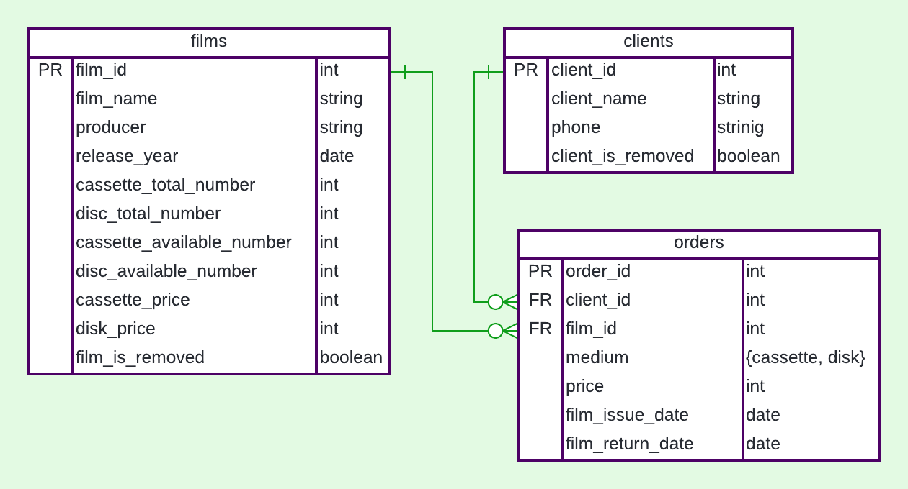

# web-server-java (Видеопрокат)

поднятый сервер: клац http://35.228.171.162/

## How to run

1. Initialize postgres database.
   [Install Postgres](https://www.postgresql.org/download/linux/ubuntu/) first if not already installed

```shell
postgres@pc$ psql
postgres=# \i <path to project root>/SQLscripts/create_db_and_user.sql 
web_server_db=> \i <path to project root>/SQLscripts/tables_creation.sql
web_server_db=> \i <path to project root>/SQLscripts/tables_fill.sql 
```

2. Run docker container with the application

```shell
$ docker pull mariamsu/web-server-java:latest && 
  docker run --rm --net=host --detach --name web_server -e HOST="127.0.0.1" -e PORT=8080 mariamsu/web-server-java
```
To work with the application open the appropriate URL in a browser.

3. Kill application

```shell
$ docker kill web_server-java
```

## How to build

1. Initialize postgres database (as in first step "How to run"). It requires for tests.

2. Build jar (this step also could be done using intellij IDEA)

```shell
web-server-java$ mvn -N io.takari:maven:wrapper  # setup maven wrapper
web-server-java$ ./mvnw package  # build executable jar 
```

3. *Optional* Run jar on specified address and port

```shell
web-server-java$ java -jar -Dserver.addres=localhost -Dserver.port=8080 ./out/artifacts/web_server_java_jar/web-server-java.jar
```

4. Build & push docker image

```shell
$ export WEB_V="v0.6"
$ docker build --build-arg JAR_FILE=target/web-server-java-1.0.jar -t mariamsu/web-server-java:latest -t mariamsu/web-server-java:${WEB_V} .
$ docker push mariamsu/web-server-java:latest ; docker push mariamsu/web-server-java:${WEB_V}
```
docker push mariamsu/web-server-java:latest,${WEB_V}
## Architecture:

The database of this application consist of 3 tables. There are POJO class, DAOInterface, DAOImplementation, service
class for every table.

* **POJO** - Plain Old Java Object - class, whose fields corresponding to columns of the table and there is a getter and
  a setter fore all columns. It is needed for storage objects of a table.
* **DAOInterface** - interface, that describes calling needed for the application. For example, such interfaces help to
  relatively painlessly change database (Postgre to lightSQL or something another, may be noSQL)
* **DAOImplementation** - class, that implements communication with the database.
* **Service** - class, that implements business logic and call DAO methods.


* **Controller** - class, that implements web user interface logic.

There is `GenericDAO_CRUD class` that has templates for main create, read, update, delete methods of DAO classes.

## Tests

**services tests**: I think it is wrong to test interaction of the application with the database by using unit tests.
But it was the simplest solution.

## Note

* **Service's methods** return `false` if something went wrong. It would be better to raise an exception with the error
  explanation (see "FailFast").

* There are problems with **data consistency**. The information about `cassette_available_number`
  and `disc_available_number`
  is saved in the columns of `films` table. But it also could be got by counting not returned orders in `ordes` table.
  Thus we need to be carefully when changing this data. I think it would be better to remove `...available_number`
  columns from database.

* There is no data consistency protection when the application is calling in **parallel**.

* [Video](https://www.youtube.com/watch?v=H68EaWZvQtE) about an architecture of modern java web servers. 
  The main idea is that JSP (JavaServer Pages) is an outdated technology.

## ================

Предполагается, что приложение используется сотрудником видеопроката, поэтому у него есть доступ ко всей информации в
базе данных и возможность выполнять все поддерживаемые операции.  
Схема навигации между страницами:


Помимо изображенных на схеме стрелок перехода между страницами имеется возможность с каждой страницы вернуться на
главную.

При открытии приложения в браузере пользователь попадает на главную страницу, откуда он может перейти либо в раздел с
информацией о клиентах, либо в раздел с информацией о фильмах.

В разделе “список клиентов” пользователь видит всех клиентов видеопроката и может либо добавить нового клиента, либо
перейти на страницу некоторого выбранного клиента.   
На странице клиента пользователь видит персональную информацию о клиенте (имя, телефон) и информацию о заказах клиента.
Пользователь может удалить клиента, поменять его персональную информацию, обновить информацию о заказах клиента. При
нажатии на кнопку "редактировать" появляется отдельное окно с небольшой таблицей, где можно изменить информацию о
клиенте.


В разделе “список фильмов” пользователь видит все фильмы, имеющиеся в прокате и может либо добавить новый фильм, либо
перейти на страницу конкретного фильма.  
На странице фильма пользователь видит информацию о фильме: название, режиссер, год выпуска, кол-во имеющихся в прокате
дисков и кассет, кто и когда брал кассеты и диски с этим фильмом и т.д. Пользователь может удалить фильм или изменить
информацию о нем. При нажатии на кнопку "редактировать" появляется отдельное окно с небольшой таблицей, где можно
изменить информацию о фильме.


Схема базы данных:



## Сценарии использования приложения:

- Получение списка клиентов: `Главная страница` -> `Список клиентов`.
- Получение списка фильмов: `Главная страница` -> `Список фильмов`.
- Получение истории выдачи и приема фильмов у клиента, списка находящихся у него фильмов: `Главная страница`
  -> `Список клиентов` -> `Клиент, чья история нужна`.
- Получение истории выдачи и приема экземпляров фильма, сводных сведений о наличии, выдаче и приеме фильмов за заданный
  интервал времени: `Главная страница` -> `Список фильмов` -> `Фильм, информация о котором нужна` -> Указать
  в `полях 'from' и 'to'` даты, за которые инетерсует история выдачи.
- Добавление клиента: `Главная страница` -> `Список клиентов` -> Кнопка `добавить` -> В появившейся `таблице` сохранить
  имя и телефон клиента.
- Добавление записи о взятии фильма в прокат: `Главная страница` -> `Список клиентов` -> `Клиент, который берет фильм`
  -> в `строке поиска` найти нужный фильм -> кнопка `выдать фильм` -> `выбрать носитель`.
- Добавление записи о возвращении фильма: `Главная страница` -> `Список клиентов` -> `Клиент, который возвращает фильм`
  -> В `списке взятых фильмов` выбрать возврвращаемый фильм -> кнопка `вернуть выбранное`.
- Добавление фильма: `Главная страница` -> `Список фильмов` -> Кнопка `добавить` -> В появившейся `таблице` сохранить
  данные о фильме.
- Изменить цену проката фильма: `Главная страница` -> `Список фильмов` -> `Фильм, информация о котором меняется` ->
  Кнопка `редактировать` -> В появившейся `таблице` изменить цену проката.
