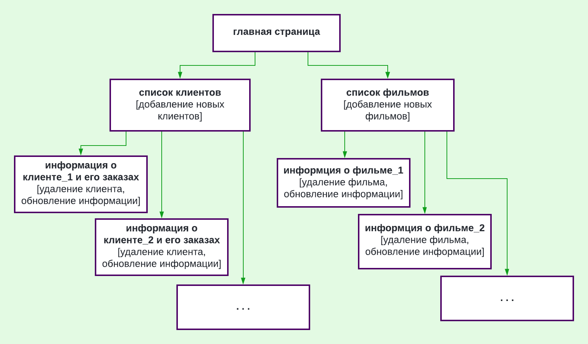
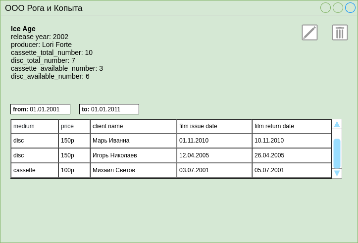

# web-server-java (Видеопрокат)

Предполагается, что приложение используется сотрудником видеопроката, поэтому у него есть доступ ко всей информации в базе данных и возможность выполнять все поддерживаемые операции.  
Схема навигации между страницами:

Помимо изображенных на схеме стрелок перехода между страницами имеется возможность с каждой страницы вернуться на главную.

При открытии приложения в браузере пользователь попадает на главную страницу, откуда он может перейти либо в раздел с информацией о клиентах, либо в раздел с информацией о фильмах.  
В разделе “список клиентов” пользователь видит всех клиентов видеопроката и может либо добавить нового клиента, либо перейти на страницу некоторого выбранного клиента.   
На странице клиента пользователь видит персональную информацию о клиенте (имя, телефон) и информацию о заказах клиента. Пользователь может удалить клиента, поменять его персональную информацию, обновить информацию о заказах клиента.

В разделе “список фильмов” пользователь видит все фильмы, имеющиеся в прокате и может либо добавить новый фильм, либо перейти на страницу конкретного фильма.  
На странице фильма пользователь видит информацию о фильме: название, режиссер, год выпуска, кол-во имеющихся в прокате дисков и кассет, кто и когда брал кассеты и диски с этим фильмом и т.д. Пользователь может удалить фильм или изменить информацию о нем.

Схема базы данных:

## Функции приложения:
- Получение списка клиентов и фильмов
- Получение истории выдачи и приема фильмов у клиента, списка находящихся у него фильмов
- Получение истории выдачи и приема экземпляров фильма, сводных сведений о наличии, выдаче и приеме фильмов за заданный интервал времени
- Внесение информации о выдаче фильма клиенту, получении от него и оплате
- Добавление и удаление клиента, чтение и редактирование данных о нем
- Добавление и удаление фильма и отдельных экземпляров, чтение и редактирование данных о фильмах и их экземплярах
## Сценарии использования приложения:
- Добавление клиента: `Главная страница` -> `Список клиентов` -> Кнопка `добавить` -> В появившейся `таблице` сохранить имя и телефон клиента.
- Добавление записи о взятии фильма в прокат: `Главная страница` -> `Список клиентов` -> `Клиент, который берет фильм` -> в `строке поиска` найти нужный фильм -> кнопка `выдать фильм` -> `выбрать носитель`.
- Добавление записи о возвращении фильма: `Главная страница` -> `Список клиентов` -> `Клиент, который возвращает фильм` -> В `списке взятых фильмов` выбрать возврвращаемый фильм -> кнопка `вернуть выбранное`.
- Добавление фильма: `Главная страница` -> `Список фильмов` -> Кнопка `добавить` -> В появившейся `таблице` сохранить данные о фильме.
- Изменить цену проката фильма: `Главная страница` -> `Список фильмов` -> `Фильм, информация о котором меняется` -> Кнопка `редактировать` -> В появившейся `таблице` изменить цену проката.

